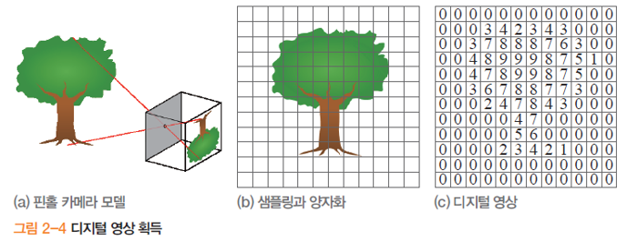
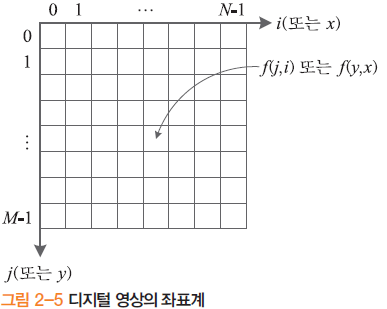
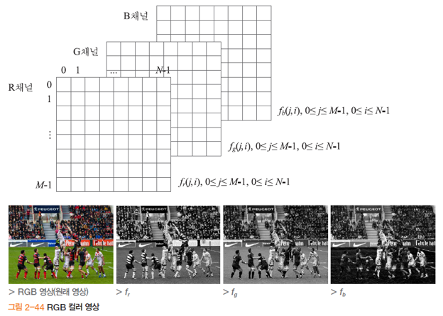
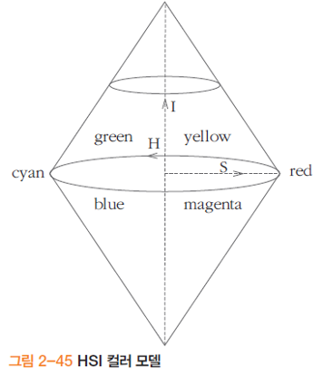
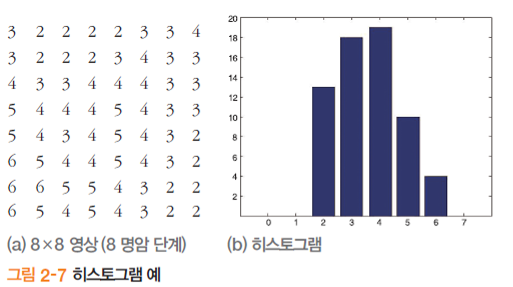
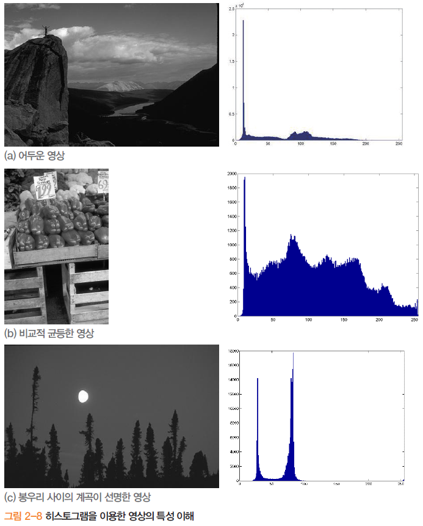
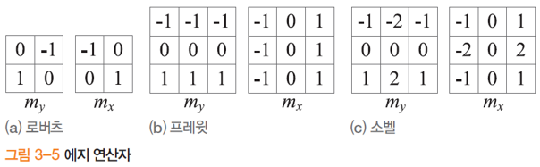
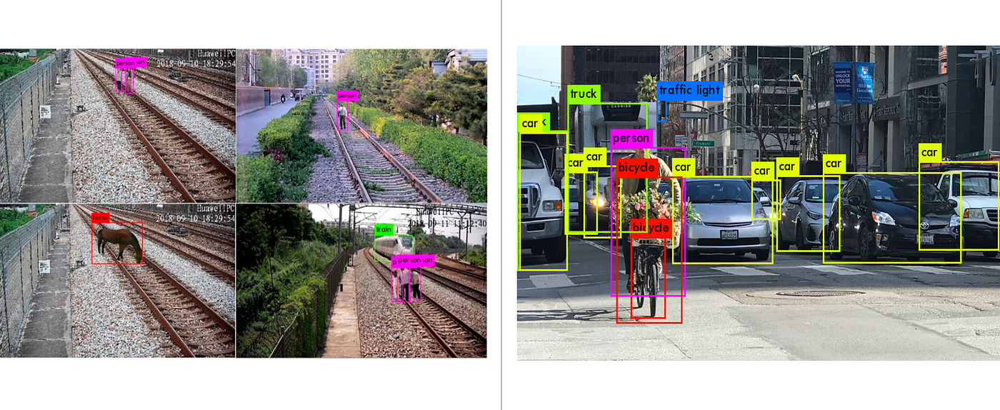

## Image Processing Tutorial

### Traditional Image Processing

#### Array-like image
아날로그 이미지는 연속적인 값을 가지게 되어 컴퓨터로 처리가 힘들다. 이를 디지털로 처리하기 위해서 양자화와 샘플링 과정을 거치게 된다.  
양자화는 공간 영역을 디지털화 하는 과정이고, 샘플링은 이미지 강도를 디지털화 하는 과정이다. 이렇게 양자화와 샘플링을 거친 이미지는 행렬로 표현이 가능하다.  
{: width="50%" height="50%"}  
이미지를 공간으로 보통 영상처리에서는 좌측 상단을 기준(0,0)으로 (y,x)로 표현한다.  
{: width="30%" height="30%"}  


#### Color Space
좌표 안의 색을 표현하는 방법을 색영역이라고 한다. 흔히 쓰는 RGB는 Red, Green, Blue로 나누어 표현하는 방법이고, 용도에 따라 HSV, YUV 등이 있다.  
{: width="50%" height="50%"}
{: width="30%" height="30%"}

#### Histogram
히스토그램은 이미지의 색상(강도) 분포를 나타낸다. 이미지의 히스토그램을 보면 이미지가 어떤 색상을 많이 가지고 있는지 분포를 확인할 수 있다.  
{: width="50%" height="50%"}  
{: width="50%" height="50%"}  

#### Filter
이미지의 정보를 얻기 위해서 여러 수학적인 과정을 거치게 되는데 이를 수행하기 위해 필요한 것이 필터이다. 필터는 컨볼루션 연산을 통해 이미지를 연산할 수 있는 연산자이다.  
필터는 이미지 미분, 엣지 검출, 노이즈 제거, 이미지 품질 향상 등에 이용된다. 필터는 커널, 마스크, 윈도우 등의 이름으로 불리기도 한다.  
{: width="50%" height="50%"}

#### DL
또한 최근에는 딥러닝을 활용한 기술을 통해 전통적인 영상처리만 사용한 방법보다 더 정확한 문제 해결이 가능하다. ex) Yolo, RCNN, ViT, SwinT  
{: width="50%" height="50%"}

#### OpenCV

##### I/O Image, Gray Scaling
Import image, grayscale, show and save.
```
import cv2
import numpy as np

def main(image_path):
    img = cv2.imread(image_path)
    gray = cv2.cvtColor(img, cv2.COLOR_BGR2GRAY)
    cv2.imshow('Original', img)
    cv2.imshow('Grayscale', gray)
    cv2.waitKey(0)
    cv2.destroyAllWindows()
    filename = 'gray_' + image_path
    cv2.imwrite(filename, gray)

if __name__ == "__main__":
    path_to_image = "test1.png"
    main(path_to_image)
```

##### Canny Edge & Hough Line Detector
Detect edge, detect lines.
```
import cv2
import numpy as np

def main(image_path):
    img = cv2.imread(image_path)
    gray = cv2.cvtColor(img, cv2.COLOR_BGR2GRAY)
    canny = cv2.Canny(gray, 50, 150, apertureSize=3)
    lines = cv2.HoughLines(canny, 1, np.pi / 180, 100)
    if lines is not None:
        for rho, theta in lines[:, 0]:
            a = np.cos(theta)
            b = np.sin(theta)
            x0 = a * rho
            y0 = b * rho
            x1 = int(x0 + 1000 * (-b))
            y1 = int(y0 + 1000 * (a))
            x2 = int(x0 - 1000 * (-b))
            y2 = int(y0 - 1000 * (a))
            cv2.line(img, (x1, y1), (x2, y2), (0, 0, 255), 2)

    cv2.imshow('Canny', canny)
    cv2.imshow('Hough Lines', img)
    cv2.waitKey(0)
    cv2.destroyAllWindows()

if __name__ == "__main__":
    path_to_image = "test1.png"
    main(path_to_image)
```

##### Harris Cornor Detector
Detect corners.
```
import cv2
import numpy as np

def main(image_path):
    img = cv2.imread(image_path)
    gray = cv2.cvtColor(img, cv2.COLOR_BGR2GRAY)

    gray = np.float32(gray)
    dst = cv2.cornerHarris(gray, blockSize=2, ksize=3, k=0.04)
    dst = cv2.dilate(dst, None)
    img[dst > 0.1 * dst.max()] = [0, 0, 255]
    cv2.imshow('Harris Corners', img)
    cv2.waitKey(0)
    cv2.destroyAllWindows()

if __name__ == "__main__":
    path_to_image = "test1.png"
    main(path_to_image)
```

##### SIFT
Matching two images.
```
import cv2
import numpy as np

def main(image_path1, image_path2):
    # Step 1: Read the two images
    img1 = cv2.imread(image_path1, cv2.IMREAD_GRAYSCALE)  # queryImage
    img2 = cv2.imread(image_path2, cv2.IMREAD_GRAYSCALE)  # trainImage

    sift = cv2.SIFT_create()
    kp1, des1 = sift.detectAndCompute(img1, None)
    kp2, des2 = sift.detectAndCompute(img2, None)
    index_params = dict(algorithm=1, trees=5)
    search_params = dict(checks=50)
    flann = cv2.FlannBasedMatcher(index_params, search_params)
    matches = flann.knnMatch(des1, des2, k=2)

    good_matches = []
    for m, n in matches:
        if m.distance < 0.7 * n.distance:
            good_matches.append(m)
    img_matches = np.empty((max(img1.shape[0], img2.shape[0]), img1.shape[1] + img2.shape[1], 3), dtype=np.uint8)

    cv2.drawMatches(img1, kp1, img2, kp2, good_matches, img_matches, flags=cv2.DrawMatchesFlags_NOT_DRAW_SINGLE_POINTS)
    cv2.imshow('Matches', img_matches)
    cv2.waitKey(0)
    cv2.destroyAllWindows()

if __name__ == "__main__":
    path_to_image_1 = "test1.png"
    path_to_image_2 = "test2.png"
    main(path_to_image_1, path_to_image_2)
```

### Rviz2
ROS에서 이미지를 받기 위해선 이미지의 토픽을 알아야 한다. Rviz를 이용하면 토픽을 확인할 수 있다. `view_robot` 런치 파일을 실행하여 토픽을 찾아보자.  
```
ros2 launch turtlebot4_viz view_robot.launch.py
```
`Add` -> `Topic` 에 들어가면 여러 토픽이 나온다. 그 중 이미지와 관련된 것을 눌러보면 카메라 화면이 보이는 토픽이 터틀봇에서 사용하는 토픽이다.  
터틀봇에서는 OAKD 카메라가 설치되어 있다. `/oakd/rgb/preview/image_raw` 가 터틀봇 카메라의 이미지 토픽이다.
(주의: 터틀봇이 독에 연결되어 있을 경우 절전모드로 전환되어 카메라 토픽이 발행되지 않음)


### CV_Bridge
카메라를 통해 ROS로 연결되는 토픽 메세지는 python에서 사용이 가능하도록 변환 과정이 필요하다. `cv_bridge` 라이브러리가 해당 과정을 도와준다. 다음 `image_subscriber.py` 파일을 작성해서 실행해보자.
```
#!/usr/bin/env python
import rclpy
from rclpy.node import Node
from rclpy.qos import qos_profile_sensor_data
from sensor_msgs.msg import Image
import numpy as np
import cv2
from cv_bridge import CvBridge


class ImageSubscriber(Node) :
   def __init__(self) :
     super().__init__('image_subscriber')
     self.bridge = CvBridge() 
     self.image_sub = self.create_subscription(
        Image, '/oakd/rgb/preview/image_raw', self.image_cb, qos_profile_sensor_data)
     self.image = []

   def image_cb(self, msg) :
     self.image = self.bridge.imgmsg_to_cv2(msg, 'bgr8')
     cv2.imshow('img', self.image)
     cv2.waitKey(1)
     
def main(args=None) :
  rclpy.init(args=args)
  node = ImageSubscriber()
  rclpy.spin(node)
  node.destroy_node()
  rclpy.shutdown()

if __name__ == '__main__' :
  main()
```
Run Python file
```
python3 image_subscriber.py
```


Figure Reference: 컴퓨터비전, 오일석, 한빛아카데미
